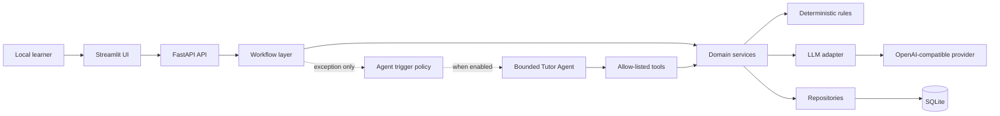
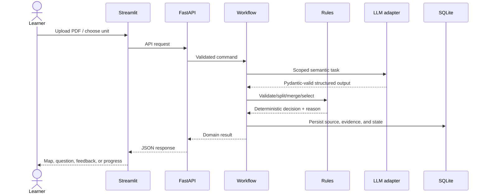

# System Architecture

> **Delivery status:** Phases 1 and 2 implement the foundation, document/KU
> workflow, LLM adapter, persistence, APIs, and Streamlit map UI. Components
> labeled Phases 3–5 remain target architecture only.

## Architectural style

The MVP is a local modular monolith. FastAPI exposes application capabilities, Streamlit provides the learner UI, and SQLite persists state. Deterministic workflows own orchestration; rules own policy; LLM calls are narrow structured tasks; the Tutor Agent is an optional exception handler.



## Dependency direction

```text
API → Workflow → Service → Rule or Agent → Repository → Database
```

- UI and API translate transport concerns only.
- Workflows define the expected sequence, transitions, and compensation behavior.
- Services implement one domain capability and call adapters or repositories.
- Rules are deterministic, side-effect-free decisions where possible.
- Agent tools call approved services; the agent never writes the database directly.
- Repositories isolate SQLAlchemy persistence.

## Components

| Component | Responsibility | Phase/status |
| --- | --- | --- |
| Configuration | Validate `.env`, expose typed settings, never log secrets | Phase 1 — completed |
| Database bootstrap | Create engine/session and initialize SQLite | Phase 1 — completed |
| Health API | Report backend liveness without requiring an LLM call | Phase 1 — completed |
| Streamlit home | Display project status and backend connectivity | Phase 1 — completed |
| Document workflow | Validate PDF, parse pages, produce Knowledge Map | Phase 2 — completed |
| Question workflow | Create candidates, answer, rubric, validation | Phase 3 — completed |
| Evaluation workflow | Score against stored rubric and persist feedback | Phase 3 — completed |
| Adaptive workflow | Select next action and update mastery | Phase 4 — completed |
| Tutor Agent | Bounded remediation under trigger policy | Phase 5 — completed |
| LLM adapter | OpenAI-compatible structured generation with retry/timeout | Phase 2 — completed |

## Primary data flow



## Why Workflow, Rule, LLM, and Agent are separate

| Mechanism | Best use | Not allowed to own |
| --- | --- | --- |
| Workflow | Known pipeline, state transition, bounded retries | Open-ended tutoring strategy |
| Rule engine | Thresholds, eligibility, split/merge, next-action policy | Semantic interpretation of prose |
| LLM | Extraction, generation, rubric-based semantic evaluation | Final policy, persistence, unbounded retries |
| Tutor Agent | Exceptional remediation needing multiple bounded tool calls | Normal document or study pipeline |

This separation makes decisions reproducible, keeps LLM failures recoverable, and allows most tests to run without a live provider.

## Trust boundaries

- PDF content and learner answers are untrusted input.
- LLM output is untrusted until Pydantic validation and domain-rule validation pass.
- Provider credentials are read from environment variables and redacted from errors/logs.
- Uploaded file paths are generated server-side and constrained to `UPLOAD_DIR`.
- The Tutor Agent can use only registered tool interfaces and cannot execute shell commands, fetch arbitrary Internet content, edit configuration, or change rules.

## Failure handling

- Transport errors map to stable error codes and understandable messages.
- LLM timeouts and invalid JSON use bounded retry with exponential backoff.
- A workflow does not persist a successful terminal state until its validation gates pass.
- The health endpoint remains independent of later-phase LLM availability.
- `AGENT_ENABLED=false` prevents all agent activation while leaving deterministic remediation available.
