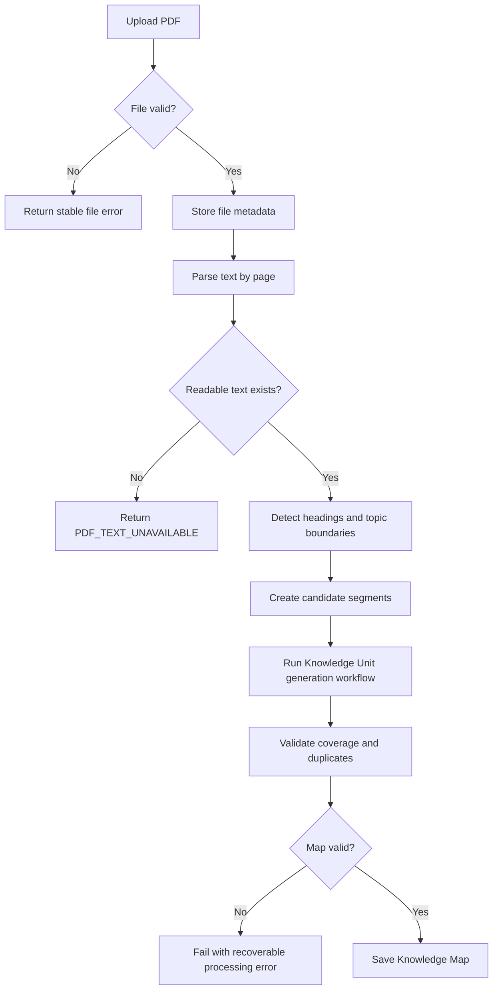
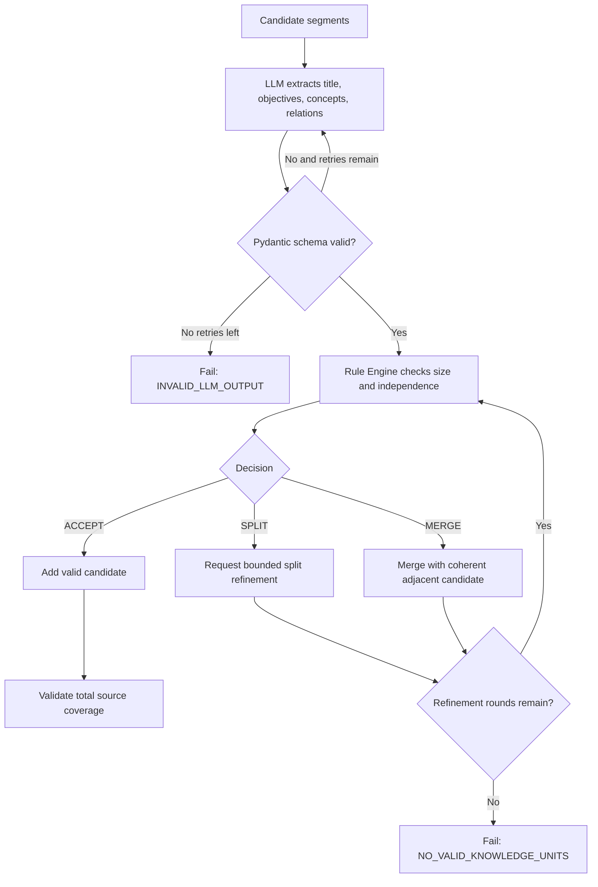
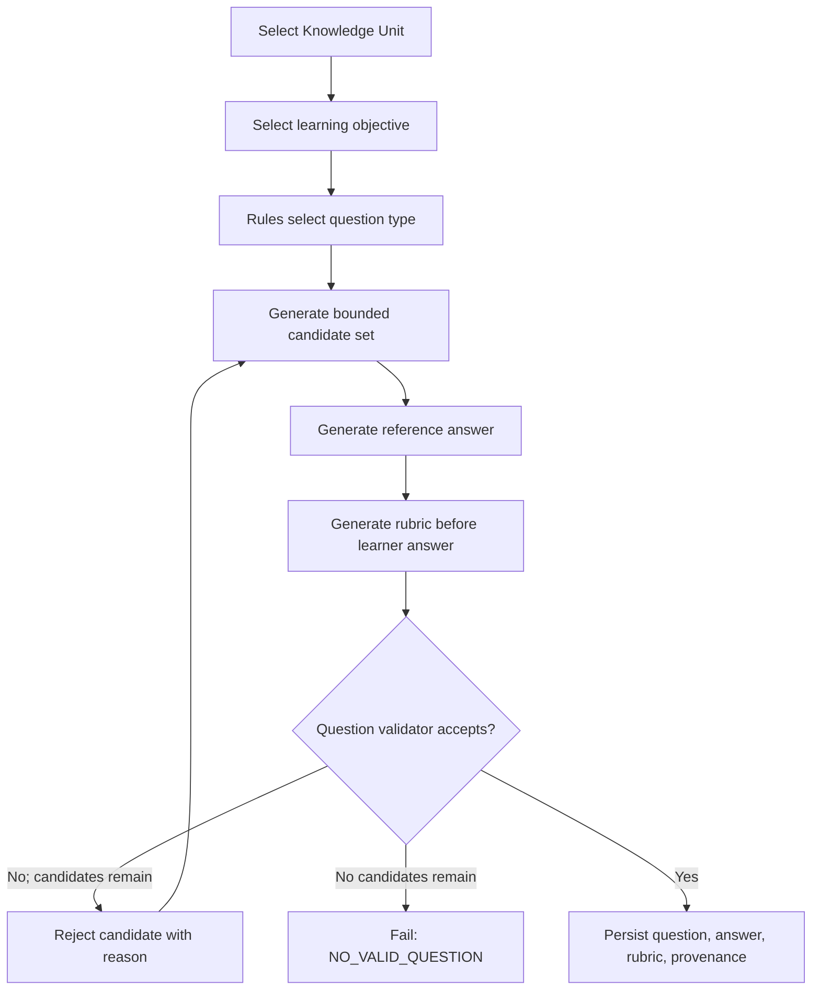
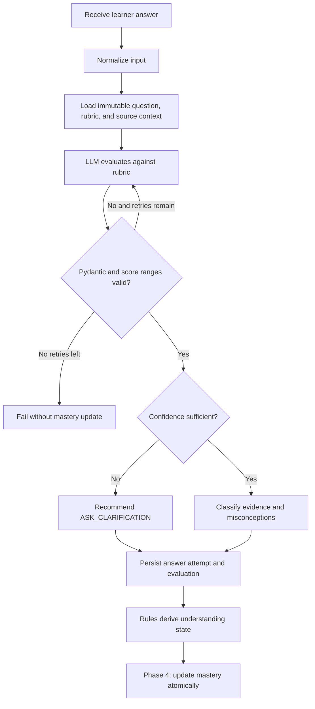
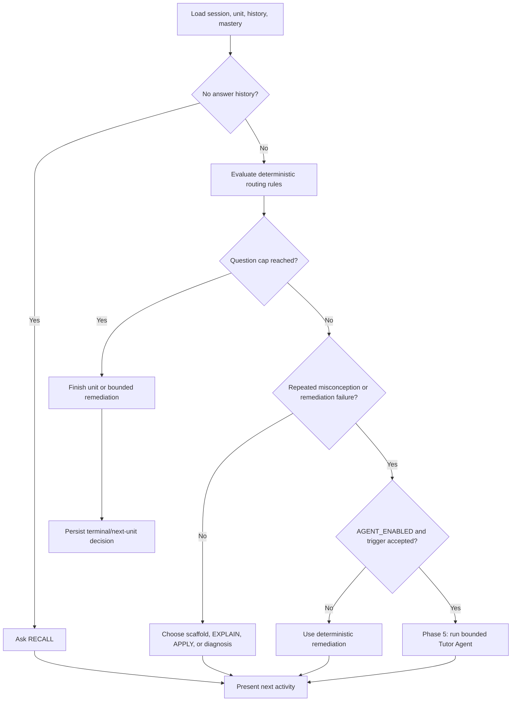

# Workflows

> **Delivery status:** Document processing and Knowledge Unit generation are
> implemented in Phase 2. Question/evaluation and adaptive workflows were
> implemented and verified in Phases 3–4; Tutor Agent exceptions in Phase 5.

Workflows are explicit, bounded sequences. An API handler validates transport input and invokes a workflow; it does not call an LLM directly. Each LLM result must pass Pydantic and domain validation before persistence.

## Document processing

Required postconditions:

- each saved page belongs to the document and keeps its page number;
- every Knowledge Unit has source pages;
- important readable pages are covered or explicitly excluded with a reason;
- no serious duplicate units are accepted; and
- retries and refinement rounds remain within configured limits.

## Knowledge Unit generation

The LLM may propose a split or merge, but deterministic rules accept or reject that proposal.

## Question generation

The validator checks source grounding, objective alignment, answer leakage, ambiguity, external knowledge, duplication, and rubric validity.

## Answer evaluation

The evaluator never changes the stored rubric. A failed evaluation is not evidence and must not update mastery.

## Adaptive learning

Routing priority is: safety/disabled checks, session limits, agent eligibility, application-gap diagnosis, then score-band selection.

## Cross-workflow guarantees

- Every transition produces a success result or a stable error code; errors are not swallowed.
- External calls have timeout and retry limits.
- Persisted terminal state is written only after its validation gates pass.
- Repeating a process request should not silently duplicate accepted domain records.
- Logs include operation, latency, model identifier, and status but exclude API keys and full document content at normal log levels.

## Implemented transaction boundaries

The synchronous Phase 2 workflow persists `processing` first, then commits
parsed pages so extraction evidence survives an LLM failure. A validated map
replacement and the `ready` transition commit together. Any known parse, LLM,
rule, or database failure rolls back current work and records `failed` when the
database remains available. Reprocessing replaces the existing map instead of
appending duplicate units.
