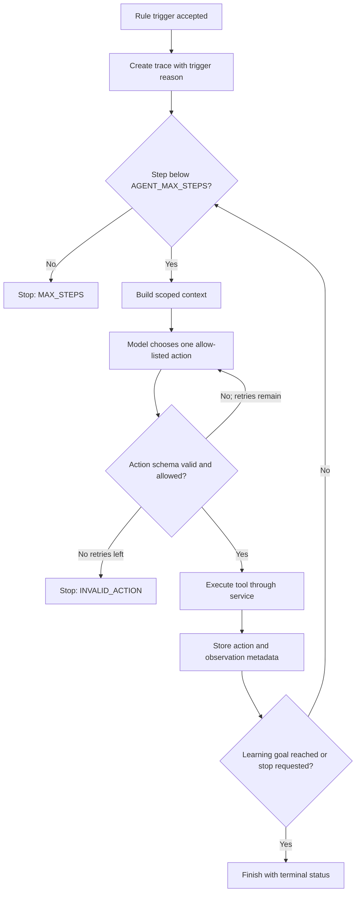

# Tutor Agent

> **Delivery status:** This is the Phase 1 design contract. The Tutor Agent is not implemented in Phase 1; bounded execution, tools, triggers, traces, and disabled-mode behavior are Phase 5 work.

## Purpose

The Tutor Agent helps a learner understand the current Knowledge Unit in a small, bounded number of steps when deterministic remediation is insufficient. It must remain inside the uploaded source, avoid immediately revealing the full answer, and never own the normal document or learning workflow.

## Trigger policy

The Rule Engine may request activation when:

- the same misconception occurs at least the configured number of times;
- a low score remains after at least two normal remediation attempts;
- recall is substantially stronger than application;
- a prerequisite needs diagnosis; or
- the learner explicitly asks for a different explanation.

`AGENT_ENABLED=false` is an absolute gate. A trigger request does not guarantee execution: policy rechecks configuration, session state, and limits.

## Allow-listed tools

| Tool | Purpose | Side-effect boundary |
| --- | --- | --- |
| `get_current_unit()` | Read current KU and source context | Read only |
| `get_user_mastery()` | Read dimension/mastery state | Read only |
| `get_answer_history()` | Read relevant attempts | Read only |
| `get_detected_misconceptions()` | Read active misconceptions | Read only |
| `get_prerequisite_units()` | Read source-linked prerequisites | Read only |
| `generate_scaffolded_question()` | Create a bounded source-grounded prompt | Goes through question service |
| `generate_counterexample()` | Create a source-supported counterexample | Goes through validation |
| `give_hint()` | Return a progressive hint | Must not reveal full answer by default |
| `give_explanation()` | Rephrase a source-supported explanation | Scoped to current/prerequisite unit |
| `evaluate_answer()` | Invoke the normal evaluation service | Uses stored rubric |
| `check_prerequisite()` | Run a prerequisite check | No direct persistence |
| `finish_unit()` | Request workflow completion | Workflow validates transition |
| `escalate_to_manual_review()` | Stop with an explicit unresolved state | No external message is sent |

Agent tools call services; they do not expose raw repositories or SQLAlchemy sessions.

## Agent loop



Function calling is preferred when supported. Otherwise, the model returns a validated action object:

```json
{
  "reason": "The learner recalls the term but cannot connect it to validation performance.",
  "action": "give_hint",
  "arguments": {"concept": "generalization"},
  "stop": false
}
```

`reason` is a brief operational justification, not private chain-of-thought.

## Stop conditions

Stop immediately when any condition holds:

- learning objective reached;
- `AGENT_MAX_STEPS` reached;
- document context is insufficient;
- learner asks to stop;
- repeated schema-invalid model output exhausts retry limit;
- an unrecoverable system error occurs; or
- policy disables or invalidates the run.

The default maximum is five steps.

## Safety boundary

The agent cannot:

- write the database directly;
- execute shell commands;
- fetch arbitrary Internet data;
- edit `.env`, source code, prompts, or rules;
- increase its own limits;
- invoke tools outside the registry;
- leave the current document/prerequisite context; or
- store private chain-of-thought.

## Trace format

Every activation and step is auditable:

```json
{
  "id": "TRACE_001",
  "session_id": "SESSION_001",
  "knowledge_unit_id": "KU_001",
  "trigger_reason": "REPEATED_MISCONCEPTION",
  "step_number": 1,
  "action": "give_hint",
  "arguments_json": {"concept": "generalization"},
  "observation_json": {"result": "Hint delivered", "status": "ok"},
  "status": "running",
  "created_at": "2026-07-30T09:00:00Z"
}
```

Store input identifiers, selected tool, brief reason, tool arguments/observation, step number, and terminal status. Do not store secrets, raw provider credentials, or private reasoning.

## Disabled-mode API behavior

When disabled, agent-run requests return HTTP `409` with error code `AGENT_DISABLED` and guidance to use deterministic remediation or enable the feature in `.env`. Trace reads may still return previously stored traces. Normal study-session endpoints must remain operational.

