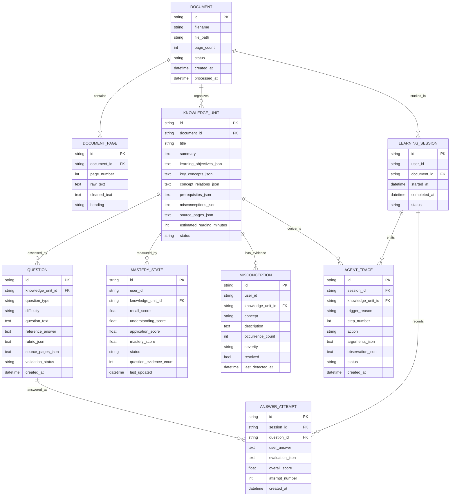

# Data Model

> **Delivery status:** Phase 1 provides the SQLite/SQLAlchemy foundation. The domain entities below are the target model for Phases 2–5 and are not claimed to exist in Phase 1.

## Entity outline

| Entity | Core fields | Relationships | Target phase |
| --- | --- | --- | --- |
| `Document` | `id`, `filename`, `file_path`, `page_count`, `status`, `created_at`, `processed_at` | Has many pages, units, and sessions | 2 |
| `DocumentPage` | `id`, `document_id`, `page_number`, `raw_text`, `cleaned_text`, `heading` | Belongs to document | 2 |
| `KnowledgeUnit` | `id`, `document_id`, `title`, `summary`, JSON metadata, reading time, `status` | Belongs to document; has many questions | 2 |
| `Question` | `id`, `knowledge_unit_id`, type, difficulty, text, answer, rubric/source JSON, status, `created_at` | Belongs to KU; has many attempts | 3 |
| `LearningSession` | `id`, `user_id`, `document_id`, timestamps, `status` | Belongs to document/user; has attempts/traces | 4 |
| `AnswerAttempt` | `id`, `session_id`, `question_id`, answer, evaluation JSON, score, attempt, `created_at` | Belongs to session and question | 3–4 |
| `MasteryState` | `id`, `user_id`, `knowledge_unit_id`, dimension scores, mastery, status, evidence count, `last_updated` | One logical row per user/KU | 4 |
| `Misconception` | `id`, `user_id`, `knowledge_unit_id`, concept, description, count, severity, resolved, detection time | Belongs to user/KU | 4 |
| `AgentTrace` | `id`, `session_id`, `knowledge_unit_id`, trigger, step, action, arguments/observation JSON, status, `created_at` | Belongs to session/KU | 5 |

The MVP may use a stable local default `user_id`; a complete account system is outside scope.

## Entity-relationship diagram

## JSON fields

| Field | Expected shape | Validation |
| --- | --- | --- |
| `learning_objectives_json` | array of 1–3 strings | Non-empty, deduplicated |
| `key_concepts_json` | array of 2–7 strings | Non-empty, deduplicated |
| `concept_relations_json` | array of `{source, relation, target}` | All keys required |
| `prerequisites_json` | array of KU identifiers | Known identifiers; no self-reference |
| `misconceptions_json` | array of strings | Non-empty entries |
| `source_pages_json` | sorted array of positive integers | Pages belong to document |
| `rubric_json` | required/optional points, alternatives, misconceptions, dimensions | Pydantic-valid; weights coherent |
| `evaluation_json` | scores, evidence lists, feedback, action, confidence | Scores in `[0,1]` |
| `arguments_json` | action-specific object | Matches registered tool schema |
| `observation_json` | redacted tool result/status | No secrets or private reasoning |

SQLite stores these as JSON-serialized text unless SQLAlchemy's JSON abstraction is used. Pydantic domain schemas remain the source of shape validation.

## Constraints and indexes

| Table | Constraint/index | Purpose |
| --- | --- | --- |
| `document_pages` | unique `(document_id, page_number)` | Prevent duplicate page ingestion |
| `knowledge_units` | index `(document_id, status)` | Load a valid Knowledge Map |
| `questions` | index `(knowledge_unit_id, question_type, validation_status)` | Select eligible questions |
| `learning_sessions` | index `(user_id, status, started_at)` | Resume recent session |
| `answer_attempts` | unique `(session_id, question_id, attempt_number)` | Stable attempt ordering |
| `answer_attempts` | index `(session_id, created_at)` | Load history |
| `mastery_states` | unique `(user_id, knowledge_unit_id)` | One current state per user/KU |
| `misconceptions` | index `(user_id, knowledge_unit_id, resolved)` | Find active misconceptions |
| `agent_traces` | unique `(session_id, step_number)` | Enforce ordered bounded steps |

Foreign keys should be enabled for SQLite connections. Destructive cascade behavior must be chosen explicitly in a later migration decision; it is not assumed by this skeleton.

